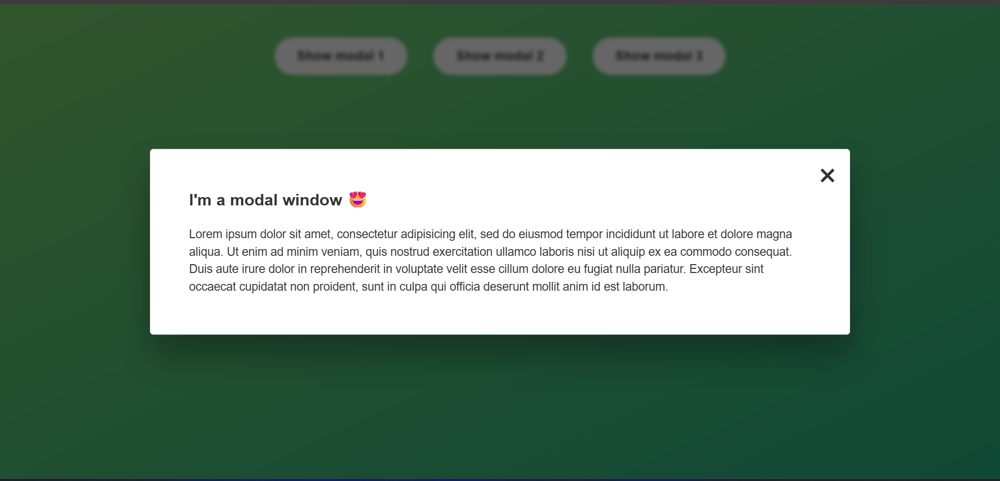

# 🪟 Modal Project

This is a simple JavaScript project that shows a modal popup with an overlay.  
The modal can be opened with a button and closed in multiple ways — click on the close (`×`) button, the overlay area, or press the `Escape` key.

---

## 📸 Demo Screenshot

---

## 🚀 Features

- ✅ Open modal by clicking a button
- ❌ Close modal by clicking the close (`×`) button
- 🌫️ Close modal by clicking on the overlay
- ⌨️ Close modal by pressing the `Escape` key
- 💡 Clean and minimal user interface using pure HTML, CSS, and JS

---

## 🛠️ Technologies Used

- HTML
- CSS
- JavaScript

---

## 🔗 Live Demo

👉 [Click here to view the live project](https://subodh2708.github.io/modal/)

---

## 🙌 Author

Made with ❤️ by [Subodh Singh](https://github.com/subodh2708)

---
